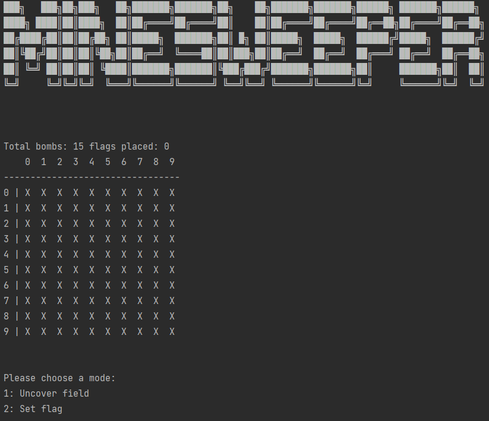
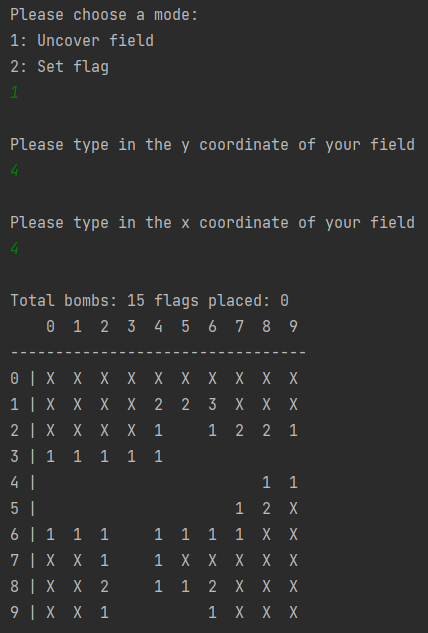
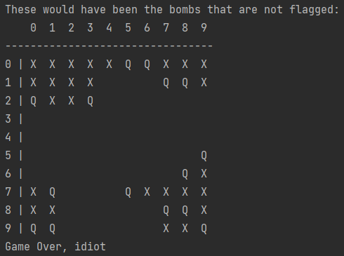
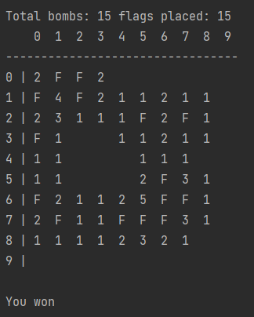

# Minesweeper Manuel

Because this is a terminal application we use following symbols:

   - Covered field: "X"
   - Uncovered field: " " or a number displaying how many bombs are around the field
   - Flag: "F"
   - Bomb: "Q"

After staring the application you should see the following:

Now you can choose the action that you want to take. But if it is your first move you can only uncover a field.

After choosing an option you then enter the y and x coordinate of the field that you want to act on. 
Here an example after choosing to uncover a field:

Then you will be asked again for your next action. Like in the first screenshot.

You can place flags on any field that is still covered (the field is displaying "X").  
To remove a flag just pick the Set Flag option and enter the coordinates of the flag you want to remove.

If you uncover a bomb, then you will be shown every bomb that has not been flagged and a game over message will be shown.

If you successfully flag every bomb and every non-bomb field is uncovered you will win the game and a victory message will be shown.

